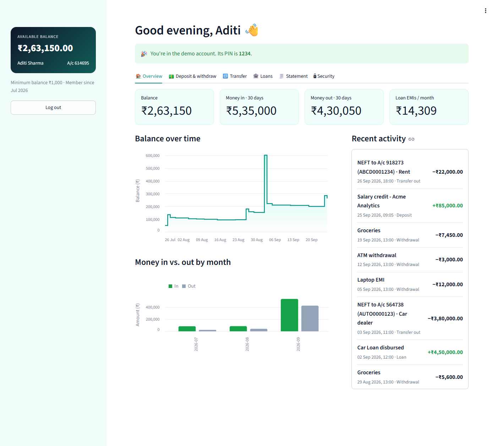
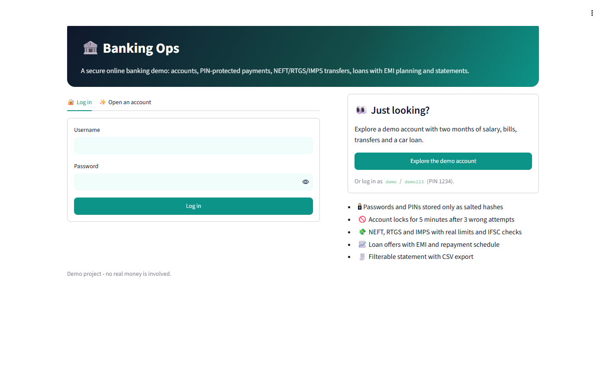
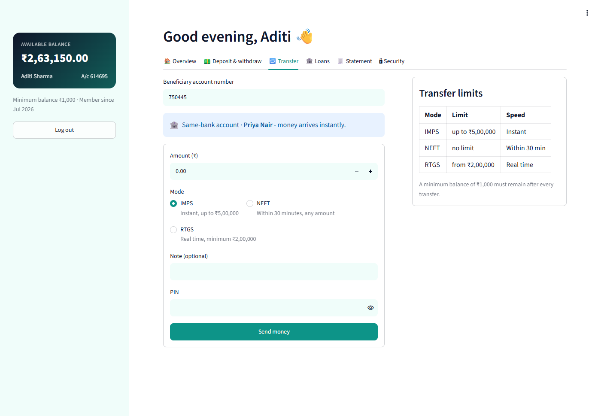
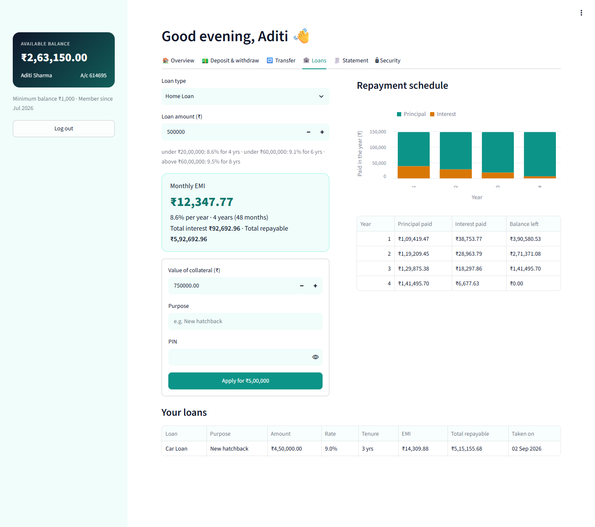
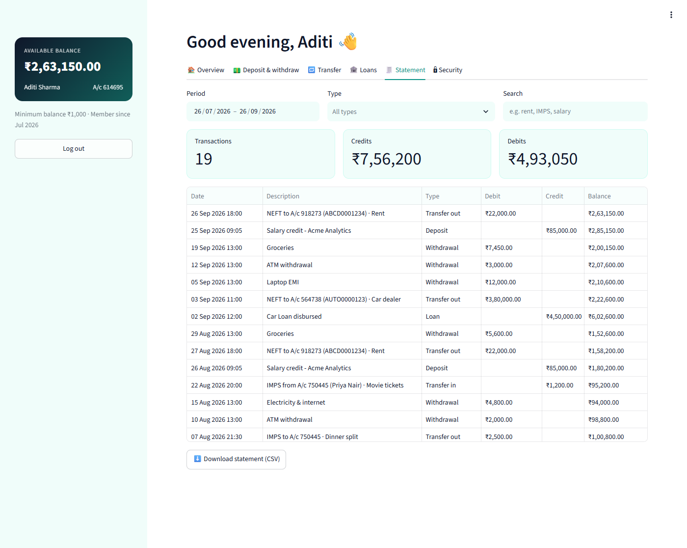

# Banking Operations

A banking simulator in two versions:

- **Banking Ops**, an online-banking web app built with Python and Streamlit.
- The original portable C99 console program.

Open accounts, log in, move money, send NEFT/RTGS/IMPS transfers, take loans and view statements.



## Web app

- **Accounts and security:**
  - Open an account with an opening deposit of at least ₹1,000.
  - Passwords and 4-digit PINs are stored only as salted PBKDF2 hashes.
  - Three wrong passwords or PINs lock the account for 5 minutes.
- **One-click demo account** with two months of salary, rent, bills, a friend's transfer and a car loan, so visitors can explore without signing up.
- **Dashboard:** balance, money in and out over 30 days, monthly loan EMIs, a balance-over-time chart, money in vs. out by month, and recent activity.
- **Deposit and withdraw** with a PIN. The ₹1,000 minimum balance is always enforced, and the app shows how much you can withdraw.
- **Transfers:**
  - Same-bank transfers show the payee's name and arrive instantly.
  - Other banks need a valid IFSC code.
  - NEFT, RTGS (minimum ₹2 lakh) and IMPS (maximum ₹5 lakh) limits match the C version.
  - Every transfer runs as a single database transaction, so a failed transfer changes nothing.
- **Loans:**
  - Home, car and personal loans with tiered rates.
  - A live EMI, total interest and repayable amount, plus a year-by-year repayment chart and table.
  - Approval requires collateral worth more than the loan.
- **Statement:** filter by date, type or text, with credit and debit totals and a CSV download.
- **Security settings:** change your PIN or password.

| Sign in or try the demo | Transfer |
|---|---|
|  |  |

| Loans | Statement |
|---|---|
|  |  |

### Run it locally

```sh
pip install -r requirements.txt
streamlit run streamlit_app.py
```

Data is stored in `bank.db` (SQLite) next to the app. Set `BANK_DB` to use a different file.

### Deploy it for free

1. Sign in to [Streamlit Community Cloud](https://share.streamlit.io) with GitHub.
2. Click **Create app** and pick this repository.
3. Keep the default main file `streamlit_app.py` and deploy.

Community Cloud storage is temporary, so accounts are cleared whenever the app restarts. The demo account can always be recreated with one click.

### Web app tests

```sh
pip install -r requirements.txt -r requirements-dev.txt
pytest
```

There are 16 tests:
- **Bank logic:** money formatting, hashing, lockouts, the minimum balance, transfer limits, that a failed transfer changes nothing, EMI and repayment schedules, and demo data consistency.
- **End-to-end app runs** with Streamlit's `AppTest`.

## Console app (C)

### Features

- **Multiple accounts:** register as many customers as you like (up to 50 per session), each with a unique username and 6-digit account number.
- **Secure login:** password confirmation at sign-up, and the account locks after 3 failed login attempts.
- **PIN-protected transactions:** every deposit, withdrawal, transfer and loan needs the 4-digit PIN, with 3 attempts allowed.
- **Deposit and withdraw:** a minimum balance of ₹1,000 is enforced, so the balance can never go negative.
- **Transfers:**
  - Transfers to another account in the same bank are credited to the recipient instantly.
  - Transfers to other banks need a validated IFSC code.
  - You can pick NEFT, RTGS (minimum ₹2 lakh) or IMPS (maximum ₹5 lakh).
- **Loans:**
  - Home, car and personal loans, each with its own tiered interest rates and tenure.
  - Each offer shows the monthly EMI, total interest and total repayable before you accept.
- **Mini statement:** your last 20 transactions with a running balance.
- **Change PIN.**
- **Accurate money handling:** amounts are stored as integer paise, so there are no floating-point rounding errors. They are displayed with Indian digit grouping (e.g. `Rs. 30,00,000.00`).

### Build and run

You need any C99 compiler (GCC, Clang, MinGW or MSVC).

```sh
make          # builds ./banking_ops
make run      # builds and starts the program
make test     # runs the scripted smoke test
```

Without `make`:

```sh
gcc -std=c99 -Wall -Wextra -O2 banking_ops.c -o banking_ops -lm
./banking_ops
```

It works on Windows, Linux and macOS.

### Loan rates

| Loan     | Tier 1                     | Tier 2                     | Tier 3                    |
|----------|----------------------------|----------------------------|---------------------------|
| Home     | < ₹20 L: 8.6%, 4 yrs       | < ₹60 L: 9.1%, 6 yrs       | ≥ ₹60 L: 9.5%, 8 yrs      |
| Car      | < ₹5 L: 9.0%, 3 yrs        | < ₹15 L: 9.5%, 5 yrs       | ≥ ₹15 L: 10.0%, 7 yrs     |
| Personal | < ₹2 L: 11.0%, 2 yrs       | < ₹10 L: 12.0%, 3 yrs      | ≥ ₹10 L: 13.0%, 5 yrs     |

A loan is approved only if the collateral value is greater than the loan amount.

## Project layout

```
streamlit_app.py       # Banking Ops web app
bankops/core.py        # money, validation, hashing, loan maths
bankops/bank.py        # SQLite bank: accounts, transfers, loans, lockouts
bankops/demo.py        # demo account with sample history
tests/py/              # web app tests (pytest)
banking_ops.c          # C console program
Makefile               # build / run / test targets for the C program
tests/session.txt      # scripted input for the C smoke test
tests/smoke_test.sh    # runs the session and checks the output
.github/workflows/     # CI: C build + tests on Linux and Windows, web app tests
```

## Limitations

This is a learning project and no real money is involved. The C program keeps data in memory only, so it is lost when the program exits, and it stores passwords in plain text in memory. The web app stores hashed credentials in a local SQLite file.
